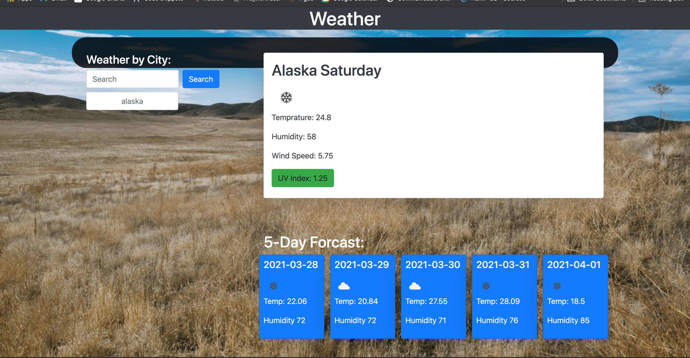
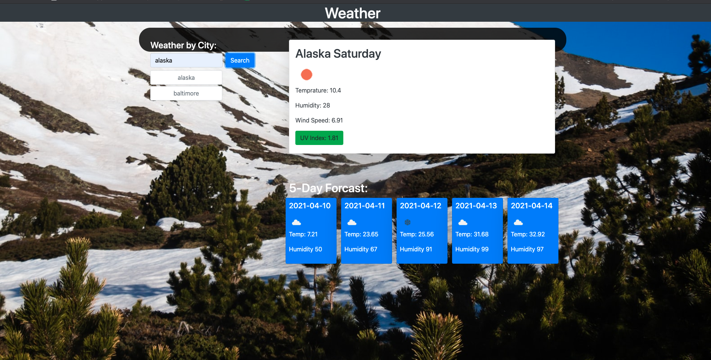

# weather

## Description 

This weather app allows the user to check the current weather, five day forcaset, wind speed, UV index, and humidity of any city. This weather app is great for people who wish to travel. The weather application uses various open weather api's in order to encorpurate its various attributes.In addtion searches are saved to local storage, allowing users to revist previously searched cities.


Dployed github  [the VSCode repository](https://momo427.github.io/weather/)


## Installation

Simply click on the deployment app and use the search bar to search the weather in any city of interest.


## Usage 

GIVEN a weather dashboard with form inputs
WHEN I search for a city
THEN I am presented with current and future conditions for that city and that city is added to the search history
WHEN I view current weather conditions for that city
THEN I am presented with the city name, the date, an icon representation of weather conditions, the temperature, the humidity, the wind speed, and the UV index
WHEN I view the UV index
THEN I am presented with a color that indicates whether the conditions are favorable, moderate, or severe
WHEN I view future weather conditions for that city
THEN I am presented with a 5-day forecast that displays the date, an icon representation of weather conditions, the temperature, and the humidity
WHEN I click on a city in the search history
THEN I am again presented with current and future conditions for that city
```

```md


```


## Credits

Open Weather api:
UV index 
Current weather api 
Daily Forecast 

## License
None

